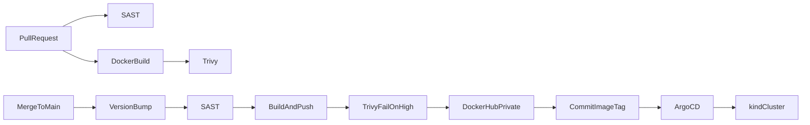

# sample-nodejs — Rafael DevOps / DevSecOps challenge

Repository: [https://github.com/eliranbt-commits/sample-nodejs](https://github.com/eliranbt-commits/sample-nodejs)

Small Express app packaged for Kubernetes: multi-stage Dockerfile, Helm chart, GitHub Actions (SAST, Trivy, Docker Hub), and ArgoCD GitOps from this same repo.

## Why a Deployment (not a StatefulSet)

The app is stateless. It keeps nothing on local disk, has no sticky identity, and any pod can serve `/my-app`, `/ready`, `/live`, and `/metrics`. A Deployment is the right controller: pods are interchangeable and can be replaced freely.

A StatefulSet would be for ordered start/stop, stable network names, or per-pod volume claims (for example a database). None of that applies here.

## Why same-repo GitOps

ArgoCD watches **this** repository (`helm/sample-nodejs` + `values-gitops.yaml`) instead of a second GitOps repo.

- One link to submit: chart, pipeline, and desired state live together.
- CI never runs `kubectl apply`. After a green scan it only commits the new image tag; ArgoCD reconciles the cluster.
- A split GitOps repo is the better default when many services share one environment. This take-home has a single app, so an extra repo would add ceremony without a clearer security boundary.

## App

| Path | Role |
| --- | --- |
| `GET /my-app` | Main response (`Hello, World!`) |
| `GET /about` | Static description |
| `GET /ready` | Readiness probe |
| `GET /live` | Liveness probe |
| `GET /metrics` | Prometheus metrics |
| `GET /classified` | Easter egg |

Port: `PORT` or `8080`. App sources live in `web-app/`. Run with `node web-app/app.js` (there is no `npm start`; `package.json` `main` is stale).

## Git workflow

Trunk-based development:

1. Feature branch → pull request into `main`.
2. PR pipeline: SAST, Helm lint, Hadolint, Docker build, Trivy. No push, no version bump.
3. Merge to `main`: patch bump (`1.0.0` → `1.0.1`), unless the commit message contains `bump:minor` or `bump:major`.
4. Image is scanned; HIGH/CRITICAL findings block the push.
5. Image is pushed to a **private** Docker Hub repo. Helm GitOps values are committed with `[skip ci]` so the pipeline does not loop. ArgoCD syncs.



## CI/CD and DevSecOps

Workflow: [`.github/workflows/ci.yml`](.github/workflows/ci.yml)

| Stage | Tool | Gate |
| --- | --- | --- |
| SAST | Semgrep (`p/javascript`, `p/nodejs`, `p/owasp-top-ten`) | Fail on ERROR |
| Dependency audit | `npm audit --audit-level=critical` | Fail on critical |
| Dockerfile lint | Hadolint | Fail on error |
| Chart lint | `helm lint` | Fail on error |
| Repo scan | Trivy filesystem | Fail on unfixed CRITICAL |
| Image scan | Trivy | Fail on unfixed HIGH/CRITICAL — **blocks deploy/push** |
| Build / push | Docker Buildx | Private Docker Hub |
| Deploy | Git commit of image tag | ArgoCD, not kubectl from CI |

Unfixed OS findings are ignored (`ignore-unfixed: true`) so the gate tracks issues we can actually patch.

### GitHub secrets (required for `main`)

| Secret | Purpose |
| --- | --- |
| `DOCKERHUB_USERNAME` | Private Hub namespace |
| `DOCKERHUB_TOKEN` | Hub access token with push access |

Create a Docker Hub repository [eliranb1978/eliran-apps-images](https://hub.docker.com/r/eliranb1978/eliran-apps-images). In GitHub: **Settings → Secrets and variables → Actions**, add `DOCKERHUB_USERNAME` (`eliranb1978`) and `DOCKERHUB_TOKEN`. Also set **Settings → Actions → General → Workflow permissions → Read and write** so the GitOps commit can push.

If the GitHub repo itself is private, give ArgoCD a PAT (repo read) as a repository credential.

## Helm chart

Path: [`helm/sample-nodejs/`](helm/sample-nodejs/)

- Deployment, Service, Ingress (`ingressClassName: nginx`)
- Readiness `/ready` and liveness `/live` with different delay/period
- ConfigMap for `PORT`; Secret template present but disabled (the app has no secret)
- CPU/memory requests and limits
- Non-root `securityContext`
- `imagePullSecrets` for the private registry overlay

| Values file | Use |
| --- | --- |
| `values.yaml` | Local kind (`sample-nodejs:local`, `pullPolicy: Never`) |
| `values-gitops.yaml` | ArgoCD / Docker Hub (CI updates `repository` and `tag`) |

Local install (image already loaded into kind):

```bash
kind load docker-image sample-nodejs:local --name play
helm upgrade --install sample-nodejs ./helm/sample-nodejs \
  --set image.repository=sample-nodejs \
  --set image.tag=local \
  --set image.pullPolicy=Never
```

## ArgoCD on local kind

Cluster context expected: `kind-play`.

```bash
export DOCKERHUB_USERNAME=your-hub-user
export DOCKERHUB_TOKEN=your-hub-token
bash scripts/bootstrap-kind-gitops.sh
```

That script creates namespaces, the `dockerhub` pull secret, installs Argo CD, and applies [`argocd/application.yaml`](argocd/application.yaml).

Push a green `main` build so `values-gitops.yaml` is pinned to a real tag on `eliranb1978/eliran-apps-images`.

```bash
kubectl -n argocd port-forward svc/argocd-server 8081:80
kubectl -n argocd get secret argocd-initial-admin-secret -o jsonpath='{.data.password}' | base64 -d; echo
kubectl -n sample-nodejs get pods,svc,ingress
curl -H 'Host: sample-nodejs.local' http://localhost/my-app
```

If ingress-nginx is not installed on kind, either install it or port-forward the Service:

```bash
kubectl -n sample-nodejs port-forward svc/sample-nodejs 8080:80
curl http://localhost:8080/my-app
```

## Screenshot / evidence checklist

Take these for submission:

1. GitHub Actions green run (SAST + Trivy + push).
2. `kubectl get pods` — `sample-nodejs` Running `1/1`.
3. ArgoCD UI: Application `Synced` / `Healthy`.
4. Browser or curl of `/my-app` through Ingress (or port-forward).
5. Docker Hub showing tags on [eliranb1978/eliran-apps-images](https://hub.docker.com/r/eliranb1978/eliran-apps-images).

## Layout

```text
.
├── Dockerfile
├── web-app/
│   ├── app.js
│   ├── package.json
│   └── package-lock.json
├── .github/workflows/ci.yml
├── argocd/application.yaml
├── helm/sample-nodejs/
├── scripts/
│   ├── next-version.sh
│   ├── apply-version.sh
│   └── bootstrap-kind-gitops.sh
└── README.md
```
